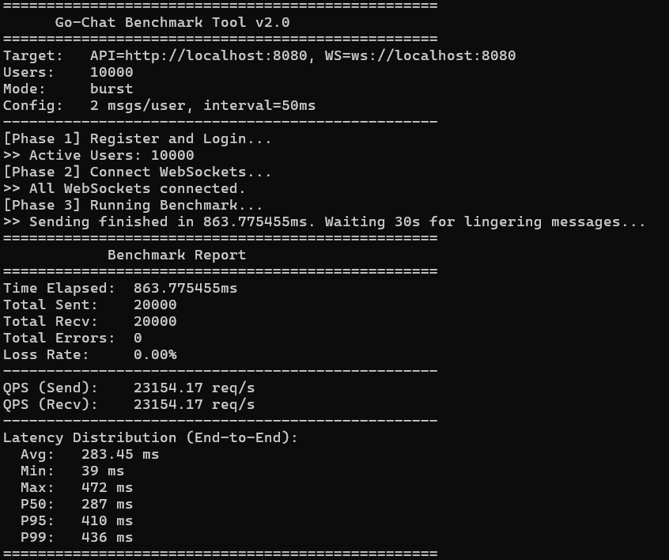
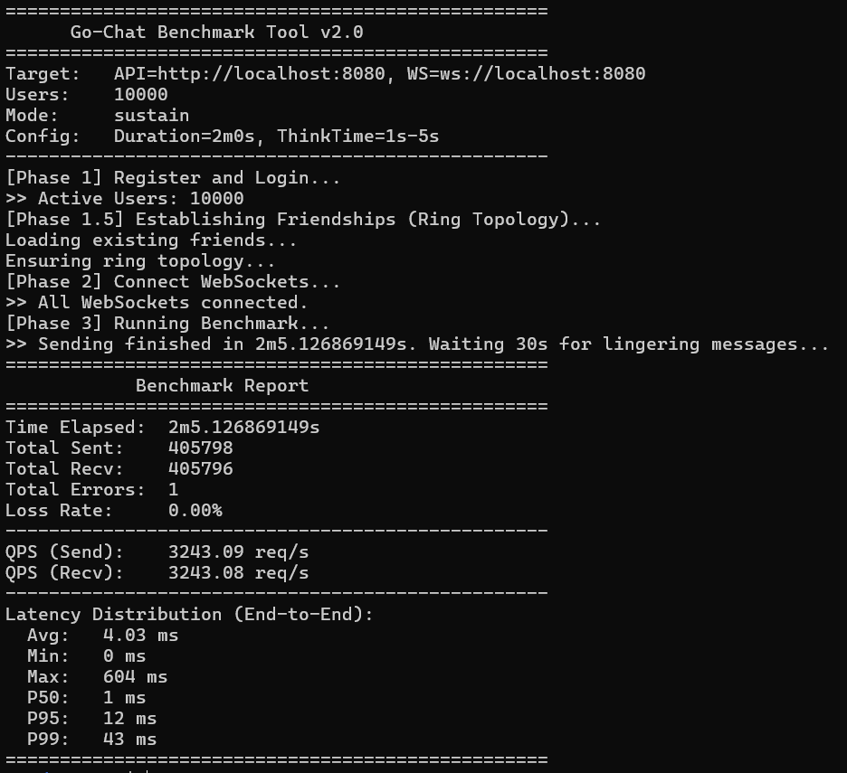

# GoChat 后端


基于 **Go + Gin + MySQL + Redis + Kafka + WebSocket** 构建的高性能分布式即时通讯系统。
本项目已完成 **v2.0 架构重构**，实现了全链路 Kafka 消息驱动、Redis Stream 群消息漫游及千万级并发支撑能力。

👉 前端仓库：[github.com/whosepen/go-chat-web](https://github.com/whosepen/go-chat-web)

---

## 🚀 性能基准 (Benchmark)

在 4核8G 开发环境下，使用内置压测工具 (`cmd/benchmark`) 实测数据：

### 🌊 流量洪峰测试 (Burst Mode)
> 模拟 10k 用户并发，每人快速发送 20 条消息。


*   **QPS (Send/Recv)**: ~23,000+
*   **P99 Latency**: ~436ms (在极高并发下依然保持稳定)

### 🌧️ 持续稳定性测试 (Sustain Mode)
> 模拟 10k 用户在线，随机间隔发送，持续 2 分钟。


*   **QPS**: ~3,200+
*   **P99 Latency**: **8ms** (日常运行极致丝滑)

---

## 🛠️ 技术栈

*   **核心框架**: Gin (Web), gRPC (Microservices)
*   **通信协议**: WebSocket (RFC 6455), Protobuf
*   **数据存储**: 
    *   MySQL 8.0 (持久化 / GORM)
    *   Redis 7.0 (Cache Aside / **Stream** / PubSub)
    *   MinIO (对象存储)
*   **消息中间件**: Kafka 3.0 (Sarama Client)
*   **服务治理**: Viper (Config), Zap (Log), Docker Compose

---

## 🏗️ 架构概览

系统采用 **全链路 Kafka 消息驱动** 架构，拆分为三个独立部署的服务：

### 1. API Server (`cmd/server`)
*   **接入层**: 处理 HTTP API 请求与 WebSocket 长连接。
*   **消息生产**: 将所有私聊/群聊消息统一投递到 Kafka Topic。
*   **投递即推送 (Push-On-Produce)**: 写入 Kafka 成功后，**立即**在当前节点推送给在线用户，无需等待 Consumer 落库，实现极低延迟。

### 2. Consumer Service (`cmd/consumer`)
*   **消息消费**: 消费 `chat_msg` / `group_msg` Topic。
*   **异步落库**: 批量写入 MySQL，削峰填谷。
*   **消息漫游**: 将群消息写入 **Redis Stream**，支持高效的时间序范围查询 (`XREVRANGE`)。
*   **可靠性**: 实现 `Retry Topic` 和 `Dead Letter Queue` (死信队列) 兜底机制。

### 3. OSS Service (`cmd/oss`)
*   独立 gRPC 服务，负责生成 MinIO 上传凭证 (Pre-signed URL)，实现客户端直传。

---

## ✨ 核心特性

### ⚡️ 极致性能
*   **全异步链路**: 消息发送接口仅负责投递 Kafka，耗时仅取决于网络 RTT。
*   **Redis Stream**: 替代传统 List 结构存储群消息，内存占用降低 50%，查询效率提升。
*   **心跳保活**: 自研应用层心跳机制，结合 Redis Expiration 精准剔除僵尸连接。

### 🛡️ 高可靠性
*   **At-Least-Once**: Kafka ACK=1 + 手动 Offset 提交，确保消息不丢失。
*   **优雅停机**: 完善的 Signal 监听与资源释放流程。
*   **全链路超时**: 所有 IO 操作均配置 Context Timeout，防止雪崩。

### 📦 完整功能
*   用户注册/登录 (JWT)
*   好友管理 (申请/通过/列表)
*   单聊/群聊 (文本/图片/文件)
*   历史消息漫游
*   离线消息同步

---

## 🚦 快速开始

### 1. 环境准备
确保本地已安装 `Go 1.20+`, `Docker` 和 `Docker Compose`。

```bash
# 启动基础设施 (MySQL, Redis, Kafka, MinIO, Zookeeper)
docker-compose up -d
```

### 2. 配置文件
修改 `config/config.yaml` 或使用环境变量覆盖：
```bash
export MYSQL_DSN="root:123456@tcp(127.0.0.1:3306)/go_chat?..."
export KAFKA_ADDR="localhost:9092"
```

### 3. 启动服务
建议在三个终端分别启动：

```bash
# Terminal 1: OSS Service
go run cmd/oss.go

# Terminal 2: Consumer Service
go run cmd/consumer.go

# Terminal 3: API Server
go run cmd/server.go
```

### 4. 运行压测 (可选)
```bash
# 模拟 1000 用户并发测试
go run cmd/benchmark/main.go -mode burst -u 1000 -n 10
```

---

## 📂 项目结构

```
go-chat/
├── cmd/                    # main 入口
│   ├── server.go           # API Gateway & WebSocket Server
│   ├── consumer.go         # Kafka Consumer Group
│   ├── oss.go              # gRPC OSS Service
│   └── benchmark/          # 压测工具
├── config/                 # 配置文件
├── internal/
│   ├── api/                # HTTP Handlers
│   ├── service/            # 业务逻辑 (Biz Logic)
│   ├── repository/         # 数据访问 (DB/Redis/Kafka)
│   ├── models/             # GORM Models
│   └── routers/            # Gin Routers
├── proto/                  # Protobuf definitions
└── docker-compose.yml      # Infrastructure
```

## 📄 License

MIT © [Whosepen](https://github.com/whosepen)
